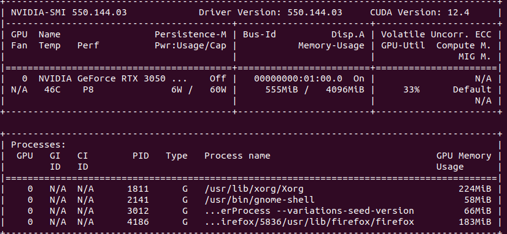

# Physics-Simulation

In this repository, you will find two physics simulations created with PyBullet.

## Free Fall Simulation

The `free_fall.py` script simulates free-falling particles in a PyBullet environment.

### Features

- Connects to the PyBullet simulator in GUI mode with full screen.
- Sets gravity to -9.8 m/s².
- Loads a simulation plane.
- Creates particles (spheres) with random initial positions and velocities.
- Configures friction and restitution for the particles.
- Runs the simulation until all particles have stopped moving.

### Usage

To run the free fall simulation, execute the following command:
```
python free_fall.py
```
## Solar System Simulation

The `solar_system.py` script simulates a solar system with a sun, planets, and an asteroid.

### Features

- Connects to the PyBullet simulator in GUI mode.
- Disables gravity and calculates it manually.
- Creates a sun (central body) with a specified mass and radius.
- Creates planets with initial positions and velocities in circular orbits.
- Creates an asteroid with an orbit influenced by the sun.
- Configures the camera to observe the system.
- Calculates gravitational acceleration and applies gravitational assistance for the asteroid.
- Uses the Leapfrog integrator for the main simulation loop.
- Allows camera controls using keyboard inputs.

### Usage

To run the solar system simulation, execute the following command:
```
python solar_system.py
```
## GPU Specifications

The simulations in this repository were tested on the following GPU:

